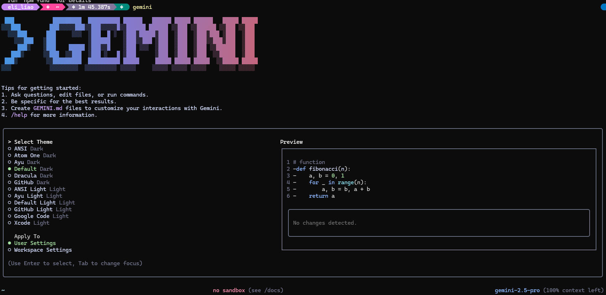
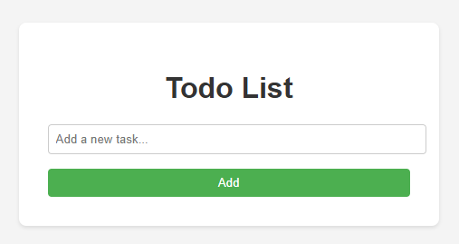

# GeminiCLI
這是我用來測試 Gemini CLI 編程能力的專案，主要記錄我操作 Gemini CLI 的步驟與流程。

---

## 安裝
```bash
# (npm 安裝沒問題，但是 npm 要升級
# nvs 每個版本裝的套件都是獨立的，所以切到最低版本 18，要再安裝一次 gemini)
npm install -g @google/gemini-cli
gemini
```

## 新增 API KEY
```bash
# GEMINI API KEY 新增 Powershell 在 $profile
$Env:GEMINI_API_KEY = 'A-------------------------------------k'
```

## 執行
```bash
gemini
```


---

## GEMINI.md
同 README.md

## MCP
在 .gemini 目錄的 settings.json 來設定
"selectedAuthType" 有兩種:
環境變數 API KEY "gemini-api-key"
與 Google 網頁登入 "oauth-personal"

範例: 安裝 context7 與 task-master

task-master 需要 npm install:
```bash
npm install -g task-master-ai
```

```json
{
  "theme": "Default",
  "selectedAuthType": "gemini-api-key",
  "mcpServers": {
    "context7": {
      "command": "npx",
      "args": [
        "-y",
        "@upstash/context7-mcp"
      ]
    },
    "taskmaster-ai": {
      "command": "npx",
      "args": [
        "-y",
        "--package=task-master-ai",
        "task-master-ai"
      ],
      "env": {
        "ANTHROPIC_API_KEY": "sk-ant-",
        "OPENAI_API_KEY": "sk-proj-",
        "GOOGLE_API_KEY": "A-------------------------------------k"
      }
    }
  }
}
```

## PROMPT 範例
我使用非常簡單的 PROMPT 來描述需求：
```bash
幫我建立一個網頁版的 todo list
```

## 操作說明

```bash
> gemini

 ███            █████████  ██████████ ██████   ██████ █████ ██████   █████ █████
░░░███         ███░░░░░███░░███░░░░░█░░██████ ██████ ░░███ ░░██████ ░░███ ░░███
  ░░░███      ███     ░░░  ░███  █ ░  ░███░█████░███  ░███  ░███░███ ░███  ░███
    ░░░███   ░███          ░██████    ░███░░███ ░███  ░███  ░███░░███░███  ░███
     ███░    ░███    █████ ░███░░█    ░███ ░░░  ░███  ░███  ░███ ░░██████  ░███
   ███░      ░░███  ░░███  ░███ ░   █ ░███      ░███  ░███  ░███  ░░█████  ░███
 ███░         ░░█████████  ██████████ █████     █████ █████ █████  ░░█████ █████
░░░            ░░░░░░░░░  ░░░░░░░░░░ ░░░░░     ░░░░░ ░░░░░ ░░░░░    ░░░░░ ░░░░░


Tips for getting started:
1. Ask questions, edit files, or run commands.
2. Be specific for the best results.
3. /help for more information.


╭────────────────────────────────────╮
│  > 幫我建立一個網頁版的 todo list  │
╰────────────────────────────────────╯
```

輸入 gemini 開啟 CLI 並輸入 PROMPT。


```bash
✦ 好的，這是一個建立網頁版 todo list 的計畫：

   1. 建立專案目錄: 我會建立一個名為 todo-list-app 的新目錄來存放所有專案檔案。
   2. 建立 HTML 檔案: 我會建立
      index.html，這將是應用程式的主頁。它會包含一個標題、一個用於新增待辦事項的文字輸入框，以及一個將顯示待辦事項的清單。
   3. 建立 CSS 檔案: 我會建立 style.css 來為應用程式設計樣式，使其外觀更美觀且易於使用。
   4. 建立 JavaScript 檔案: 我會建立 script.js 來處理使用者互動，例如新增待辦事項和將其標記為已完成。
   5. 連結檔案: 我會將 style.css 和 script.js 檔案連結到 index.html，以確保樣式和功能都正確載入。

  完成後，你將擁有一個功能齊全的待辦事項清單網頁應用程式。
```

Gemini 會制訂一個計劃。

```bash
  我現在就開始執行第一步，建立專案目錄。
 ╭──────────────────────────────────────────────────────────────────────────────────────────────────────────╮
 │ ✔  Shell mkdir todo-list-app (Create a new directory named `todo-list-app` to house the project files.)  │
 ╰──────────────────────────────────────────────────────────────────────────────────────────────────────────╯
✦ 好的，todo-list-app 目錄已建立。現在，我將在 todo-list-app 目錄中建立 index.html 檔案。
 ╭──────────────────────────────────────────────────────────────────────────────────────────────────────────────────╮
 │ ✔  WriteFile Writing to todo-list-app\index.html                                                                 │
 │                                                                                                                  │
 │     1 <!DOCTYPE html>                                                                                            │
 │     2 <html lang="en">                                                                                           │
 │     3 <head>                                                                                                     │
 │     4     <meta charset="UTF-8">                                                                                 │
 │     5     <meta name="viewport" content="width=device-width, initial-scale=1.0">                                 │
 │     6     <title>Todo List</title>                                                                               │
 │     7     <link rel="stylesheet" href="style.css">                                                               │
 │     8 </head>                                                                                                    │
 │     9 <body>                                                                                                     │
 │    10     <div class="container">                                                                                │
 │    11         <h1>Todo List</h1>                                                                                 │
 │    12         <input type="text" id="taskInput" placeholder="Add a new task...">                                 │
 │    13         <button id="addButton">Add</button>                                                                │
 │    14         <ul id="taskList"></ul>                                                                            │
 │    15     </div>                                                                                                 │
 │    16     <script src="script.js"></script>                                                                      │
 │    17 </body>                                                                                                    │
 │    18 </html>                                                                                                    │
 ╰──────────────────────────────────────────────────────────────────────────────────────────────────────────────────╯
✦ index.html 檔案已建立。現在，我將在 todo-list-app 目錄中建立 style.css 檔案。
 ╭──────────────────────────────────────────────────────────────────────────────────────────────────────────────────╮
 │ ✔  WriteFile Writing to todo-list-app\style.css                                                                  │
 │                                                                                                                  │
 │     1 body {                                                                                                     │
 │     2     font-family: sans-serif;                                                                               │
 │     3     background-color: #f4f4f4;                                                                             │
 │     4     margin: 0;                                                                                             │
 │     5     display: flex;                                                                                         │
 │     6     justify-content: center;                                                                               │
 │     7     align-items: center;                                                                                   │
 │     8     min-height: 100vh;                                                                                     │
 │     9 }                                                                                                          │
 │    10                                                                                                            │
 │    11 .container {                                                                                               │
 │    12     background-color: #fff;                                                                                │
 │    13     padding: 2rem;                                                                                         │
 │    14     border-radius: 8px;                                                                                    │
 │    15     box-shadow: 0 2px 4px rgba(0, 0, 0, 0.1);                                                              │
 │    16     width: 400px;                                                                                          │
 │    17 }                                                                                                          │
 │    18                                                                                                            │
 │    19 h1 {                                                                                                       │
 │    20     text-align: center;                                                                                    │
 │    21     color: #333;                                                                                           │
 │    22 }                                                                                                          │
 │    23                                                                                                            │
 │    24 input[type="text"] {                                                                                       │
 │    25     width: 100%;                                                                                           │
 │    26     padding: 0.5rem;                                                                                       │
 │    27     border: 1px solid #ccc;                                                                                │
 │    28     border-radius: 4px;                                                                                    │
 │    29     margin-bottom: 1rem;                                                                                   │
 │    30 }                                                                                                          │
 │    31                                                                                                            │
 │    32 button {                                                                                                   │
 │    33     background-color: #4CAF50;                                                                             │
 │    34     color: white;                                                                                          │
 │    35     padding: 0.5rem 1rem;                                                                                  │
 │    36     border: none;                                                                                          │
 │    37     border-radius: 4px;                                                                                    │
 │    38     cursor: pointer;                                                                                       │
 │    39     width: 100%;                                                                                           │
 │    40 }                                                                                                          │
 │    41                                                                                                            │
 │    42 button:hover {                                                                                             │
 │    43     background-color: #45a049;                                                                             │
 │    44 }                                                                                                          │
 │    45                                                                                                            │
 │    46 ul {                                                                                                       │
 │    47     list-style-type: none;                                                                                 │
 │    48     padding: 0;                                                                                            │
 │    49     margin: 0;                                                                                             │
 │    50 }                                                                                                          │
 │    51                                                                                                            │
 │    52 li {                                                                                                       │
 │    53     padding: 0.5rem;                                                                                       │
 │    54     border-bottom: 1px solid #eee;                                                                         │
 │    55     display: flex;                                                                                         │
 │    56     justify-content: space-between;                                                                        │
 │    57     align-items: center;                                                                                   │
 │    58 }                                                                                                          │
 │    59                                                                                                            │
 │    60 li:last-child {                                                                                            │
 │    61     border-bottom: none;                                                                                   │
 │    62 }                                                                                                          │
 │    63                                                                                                            │
 │    64 li.completed {                                                                                             │
 │    65     text-decoration: line-through;                                                                         │
 │    66     color: #aaa;                                                                                           │
 │    67 }                                                                                                          │
 │    68                                                                                                            │
 │    69 .delete-button {                                                                                           │
 │    70     background-color: #f44336;                                                                             │
 │    71     color: white;                                                                                          │
 │    72     border: none;                                                                                          │
 │    73     padding: 0.3rem 0.6rem;                                                                                │
 │    74     border-radius: 4px;                                                                                    │
 │    75     cursor: pointer;                                                                                       │
 │    76 }                                                                                                          │
 ╰──────────────────────────────────────────────────────────────────────────────────────────────────────────────────╯
✦ style.css 檔案已建立。現在，我將在 todo-list-app 目錄中建立 script.js 檔案。
 ╭──────────────────────────────────────────────────────────────────────────────────────────────────────────────────╮
 │ ✔  WriteFile Writing to todo-list-app\script.js                                                                  │
 │                                                                                                                  │
 │     1 document.addEventListener('DOMContentLoaded', () => {                                                      │
 │     2     const taskInput = document.getElementById('taskInput');                                                │
 │     3     const addButton = document.getElementById('addButton');                                                │
 │     4     const taskList = document.getElementById('taskList');                                                  │
 │     5                                                                                                            │
 │     6     addButton.addEventListener('click', addTask);                                                          │
 │     7     taskList.addEventListener('click', handleTaskClick);                                                   │
 │     8                                                                                                            │
 │     9     function addTask() {                                                                                   │
 │    10         const taskText = taskInput.value.trim();                                                           │
 │    11         if (taskText === '') return;                                                                       │
 │    12                                                                                                            │
 │    13         const li = document.createElement('li');                                                           │
 │    14         li.textContent = taskText;                                                                         │
 │    15                                                                                                            │
 │    16         const deleteButton = document.createElement('button');                                             │
 │    17         deleteButton.textContent = 'Delete';                                                               │
 │    18         deleteButton.classList.add('delete-button');                                                       │
 │    19                                                                                                            │
 │    20         li.appendChild(deleteButton);                                                                      │
 │    21         taskList.appendChild(li);                                                                          │
 │    22                                                                                                            │
 │    23         taskInput.value = '';                                                                              │
 │    24     }                                                                                                      │
 │    25                                                                                                            │
 │    26     function handleTaskClick(event) {                                                                      │
 │    27         if (event.target.tagName === 'LI') {                                                               │
 │    28             event.target.classList.toggle('completed');                                                    │
 │    29         } else if (event.target.classList.contains('delete-button')) {                                     │
 │    30             event.target.parentElement.remove();                                                           │
 │    31         }                                                                                                  │
 │    32     }                                                                                                      │
 │    33 });                                                                                                        │
 ╰──────────────────────────────────────────────────────────────────────────────────────────────────────────────────╯
✦ 所有檔案都已建立完成！
```

確認建立檔案 style.css 和 script.js 與 index.html 檔案。

```bash
  我為您建立了以下檔案：

   * todo-list-app/index.html
   * todo-list-app/style.css
   * todo-list-app/script.js

  您現在可以在網頁瀏覽器中開啟 todo-list-app/index.html 檔案來使用您的待辦事項清單應用程式。

Using 1 GEMINI.md file and 2 MCP servers (ctrl+t to view)
╭────────────────────────────────────────────────────────────────────────────────────────────────────────────────────────╮
│ >   Type your message or @path/to/file                                                                                 │
╰────────────────────────────────────────────────────────────────────────────────────────────────────────────────────────╯

D:\github\chiisen\GeminiCLI (main*)               no sandbox (see /docs)                 gemini-2.5-pro (99% context left)
```

最後回報結果。



